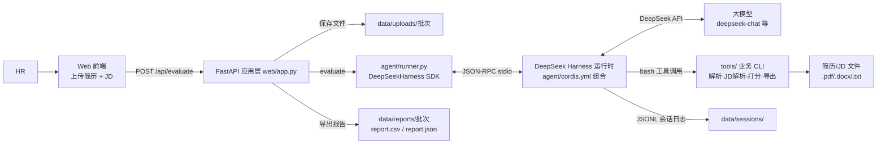

# 📄 Resume Agent — 智能简历初筛 Agent

[](https://www.python.org/)
[](https://fastapi.tiangolo.com/)
[](https://github.com/deepseek-ai/deepseek-harness)
[](LICENSE)

> 面向 HR 招聘场景的简历初筛 Agent：解析简历与 JD → **规则引擎打分（硬性条件一票否决）** → **大模型语义复核** → 生成筛选结论、理由与面试问题 → 导出 CSV/JSON 报告。评分全程可解释，杜绝“拍脑袋筛人”。

---

## 📌 项目背景与解决痛点

招聘旺季 HR 面临的现实问题：

| 痛点 | 现状 | 本项目方案 |
|---|---|---|
| 海量简历筛不动 | 一个岗位上百份投递，逐份通读平均 3-5 分钟/份 | 规则引擎秒级完成硬性条件与技能命中检查，优先看高分简历 |
| 筛选标准不统一 | 不同 HR 对同一份简历结论不同，主观性强 | 统一评分公式 + 一票否决规则，同批简历结果可复现 |
| 结论无依据 | 淘汰原因说不清，用人部门质疑筛选质量 | 每份简历输出命中/缺失技能、优点、疑虑与面试问题，结论可解释可追溯 |

**业务价值**：Agent 做“初筛 + 依据生成”，HR 做最终复核——效率提升的同时保留人的决策权，也让筛选过程有据可查。

## 🏗️ 总体架构



## 🧠 核心 Agent 设计

### 1. “规则打底、LLM 复核”的混合架构（本项目最大亮点）

```
┌───────────────────── 规则引擎（纯 Python，零幻觉）──────────────────────┐
│ resume_parser 提取基础信息 → jd_parser 提取需求清单 → score_match 打分 │
│  · 硬性条件（学历/年限/专业）一票否决，不因总分放行                      │
│  · 技能分 60 + 学历分 20 + 经验分 20，每分可解释、可复现                │
└───────────────────────────────────────────────────────────────────────┘
                                ↓ 规则结果作为输入
┌───────────────────── LLM 语义复核（DeepSeek Harness 编排）─────────────┐
│  · 识别规则抓不到的匹配点（项目经历 vs JD 职责的实质匹配）              │
│  · 语义调整限幅 ±10 分且必须给出依据（防主观漂移）                      │
│  · 生成 3-5 个针对性面试问题（围绕缺失技能与疑虑）                      │
└───────────────────────────────────────────────────────────────────────┘
```

**为什么这样设计**：招聘筛选最怕两件事——AI 幻觉（虚构候选人经历）和不可解释（说不清为什么淘汰）。规则引擎保证客观项零幻觉、可复现；LLM 只做它擅长的语义理解与追问设计，且调整被限幅约束。

### 2. 编排方式：DeepSeek Harness Python SDK

- 官方 [`deepseek-harness-sdk`](https://github.com/deepseek-ai/deepseek-harness/blob/master/docs/user/guide/python-sdk.md)，`DeepSeekHarness` 实例常驻复用，每份简历独立 `session_id`；
- 运行时组合 `agent/cordis.yml`（基于官方 `minimal.cordis.yml` 改造），HR 初筛 SOP 通过 `persona` 注入；
- JSONL 会话日志完整记录模型往返与工具调用，可审计、可复盘 Prompt 效果。

### 3. 工具调用（4 个业务工具，均输出单行 JSON）

| 工具 | 能力 |
|---|---|
| `tools/resume_parser.py` | 解析 .pdf/.docx/.txt 简历 → 全文 + 基础信息（姓名/联系方式/学历/年限/专业） |
| `tools/jd_parser.py` | 解析 JD → 硬性条件清单 + 技能清单（内置词典，可扩充）+ 加分项 |
| `tools/score_match.py` | 规则打分：硬性条件一票否决 + 三维加权（技能 60/学历 20/经验 20） |
| `tools/report_export.py` | 导出筛选报告：CSV（utf-8-sig，Excel 不乱码）+ JSON |

### 4. Agent 工作流（SOP 写入系统提示词）

```text
解析简历 → 解析 JD → 规则打分 → 语义复核（限幅 ±10 分）
        → 生成面试问题 → 输出结构化 JSON 结论
```

## 📦 功能模块

1. **简历/JD 上传与解析**：网页上传简历（支持 .pdf/.docx/.txt），JD 支持文件上传或直接粘贴；
2. **多维可解释评分**：总分 = 技能 60 + 学历 20 + 经验 20，逐项展示得分依据；
3. **硬性条件一票否决**：学历/年限/专业不达标直接“建议淘汰”，附具体不达标项；
4. **语义复核与面试问题**：LLM 识别规则漏掉的匹配点，输出优点、疑虑与 3-5 个面试问题；
5. **报告导出**：每份评估导出 JSON（程序处理）+ CSV（HR 批量归档）；
6. **离线规则演示**：`demo_tools.py` 无 API Key 跑通「解析 → 打分」全链路。

## 🛠️ 技术栈

| 层 | 技术 |
|---|---|
| Agent 编排 | DeepSeek Harness（Python SDK + Cordis 运行时组合） |
| 大模型 | DeepSeek API（`deepseek-chat` 等，端点/模型可配） |
| 规则引擎 | Python 3.10+（正则提取 + 加权评分，零幻觉可复现） |
| 简历解析 | pypdf（.pdf）+ python-docx（.docx）+ 文本直读（.txt） |
| Web | FastAPI + Uvicorn + 原生 HTML/JS |
| 报告 | CSV（utf-8-sig）/ JSON 落盘 |

## 🚀 快速开始

### 0. 平台与前置要求

- **Python 3.10+**
- **操作系统**：DeepSeek Harness Python SDK 官方运行时 wheel 支持 **Linux x64/arm64、macOS 14+ arm64**。Windows 用户请在 **WSL2** 中运行（规则引擎与 Web 层本身跨平台）。
- **DeepSeek API Key**：在 [platform.deepseek.com](https://platform.deepseek.com) 申请。

### 1. 安装 DeepSeek Harness Python SDK（二选一）

```bash
# 方式 A：官方发布版（官方文档路径）
pip install deepseek-harness-sdk
# SDK 会自动安装同版本的运行时（deepseek-harness-runtime-bin）

# 方式 B：官方源码构建（当 PyPI 尚无对应平台 wheel，或想自定义运行时组合时）
git clone https://github.com/deepseek-ai/deepseek-harness.git
cd deepseek-harness
pnpm install
pnpm exec tsx scripts/build-exe-for-python-sdk.ts   # 构建单文件运行时
# 回到本项目，用 uv 以 editable 方式安装 SDK（官方 uv.sources 自动关联本地 runtime-bin）：
uv pip install -e /path/to/deepseek-harness/python/sdk
```

> SDK 用法以上游官方文档为准：<https://github.com/deepseek-ai/deepseek-harness/blob/master/docs/user/guide/python-sdk.md>

### 2. 安装业务依赖并配置密钥

```bash
pip install -r requirements.txt
# 国内网络较慢时可加镜像源：
# pip install -r requirements.txt -i https://pypi.tuna.tsinghua.edu.cn/simple
cp .env.example .env          # 编辑 .env，填入 DEEPSEEK_API_KEY=sk-xxxx
python tools/sample_data.py   # 生成示例简历（txt/docx）与两个示例 JD
```

### 3. 启动

```bash
python run.py                 # 打开 http://127.0.0.1:8000
```

网页上：选择 `data/samples/示例简历_张三.docx` + `示例JD_AI应用开发.txt`（推荐面试案例）；
再试 `示例JD_Java后端.txt`（要求 3 年以上 → 硬性条件一票否决案例）。

没有 API Key 也可以先验证规则引擎：

```bash
python demo_tools.py          # 离线演示：生成样本 → 解析 → 规则打分（一正一反两个案例）
```

## 📡 API 一览

| 方法 | 路径 | 说明 |
|---|---|---|
| GET | `/` | 演示页面 |
| POST | `/api/evaluate` | multipart 上传简历 + JD（文件或文本），同步返回初筛结果与报告链接 |
| GET | `/api/reports/{batch}/{filename}` | 下载筛选报告（CSV/JSON） |
| GET | `/api/health` | 健康检查 |

命令行示例（curl）：

```bash
curl -X POST http://127.0.0.1:8000/api/evaluate \
  -F "resume=@data/samples/示例简历_张三.docx" \
  -F "jd_text=$(cat data/samples/示例JD_AI应用开发.txt)"
```

## 📁 目录结构

```text
project2-resume-agent/
├── run.py                  # 一键启动 Web 服务
├── demo_tools.py           # 离线规则引擎演示（无需 API Key）
├── config.py               # 全局配置（.env、路径、评分阈值）
├── requirements.txt
├── .env.example
├── agent/                  # Agent 编排层
│   ├── cordis.yml          # DeepSeek Harness 运行时组合（改自官方示例）
│   ├── prompts.py          # HR 初筛 SOP + 任务模板
│   └── runner.py           # DeepSeekHarness SDK 封装
├── tools/                  # 业务工具层
│   ├── resume_parser.py    # 简历解析（.pdf/.docx/.txt + 正则提取基础信息）
│   ├── jd_parser.py        # JD 解析（硬性条件/技能词典/加分项）
│   ├── score_match.py      # 规则打分引擎（一票否决 + 三维加权）
│   ├── report_export.py    # 报告导出（CSV/JSON）
│   └── sample_data.py      # 生成示例简历与 JD
├── web/                    # 展示层
│   ├── app.py              # FastAPI：上传、评估、报告下载
│   └── static/index.html   # 原生 JS 前端
└── data/                   # 运行时数据（samples/uploads/reports/sessions）
```

## ✨ 项目亮点

1. **混合架构防幻觉**：客观项规则计算、语义项 LLM 复核、调整限幅 ±10 分——把“AI 胡说”的风险关进笼子；
2. **结论全程可解释**：每份简历都有硬性检查明细、分项得分、优点/疑虑清单，淘汰也有依据；
3. **真实业务闭环**：上传 → 评估 → 报告落盘（CSV 可直接进 Excel 归档），不是一次性聊天 demo；
4. **规则与模型解耦**：规则引擎可独立测试（`demo_tools.py`），换模型/换端点不影响评分底座；
5. **批量扩展路径清晰**：`score_match.py` 是无状态函数，遍历简历目录即可批量打分，Roadmap 已规划；
6. **技术选型克制**：无向量库、无前端框架，依赖仅 6 个包，应届生水平可完整讲清每一行。

## 🗺️ Roadmap

- [ ] 批量模式：上传简历压缩包/目录，一次评估 N 份并输出汇总 CSV
- [ ] 简历信息抽取升级：LLM 结构化抽取（姓名/公司/时间线）与规则提取互相校验
- [ ] 多 JD 匹配：一份简历同时匹配多个岗位，输出“最匹配岗位建议”
- [ ] 面试问题分级：按「必问/追问/考察深度」标注问题类型
- [ ] 评分规则可视化配置页（阈值、技能词典、权重在线调整）

## ❓ 常见问题

**Q：规则分和 Agent 总分是什么关系？**
A：`score_match.py` 输出规则分（纯计算、可复现）；Agent 在规则分基础上做语义复核，最多调整 ±10 分（`MAX_SEMANTIC_ADJUST` 可配）得到最终总分，且必须写明调整依据。前端并排展示两者，便于对比。

**Q：为什么技能匹配用词典而不是向量检索？**
A：技术岗位 JD 的技能词是封闭高频词汇（Python/SpringBoot/MySQL…），词典匹配快、准、可解释；词典未收录的新词由 LLM 语义复核兜底。词典在 `tools/jd_parser.py` 的 `SKILLS` 里，可直接扩充。

**Q：硬性条件判断错了怎么办？**
A：`score_match.py` 的 `_check_hard` 返回每条条件的「要求/实际/是否通过/备注」，前端完整展示。规则判错的场景正是 LLM 复核的价值所在（但铁律：硬性不通过时 verdict 必须为“建议淘汰”，规则修正需改代码，保证口径一致）。

**Q：原生 Windows 上能打开页面吗？**
A：能。页面与离线规则引擎（`demo_tools.py`）在任何平台都能运行；只有提交初筛任务时，页面会友好提示需要 DeepSeek Harness SDK 运行时（官方 wheel 支持 Linux x64/arm64、macOS 14+ arm64），请在 WSL2 中启动完整版。

**Q：Agent 通过 bash 调用 CLI 工具，和函数调用有什么区别？**
A：这是 DeepSeek Harness SDK 默认运行时组合的工具调用方式：模型面向的是持久 bash 工具，业务能力封装为输出 JSON 的 CLI。好处是每次工具调用都完整落在 JSONL 审计日志中，且工具可以脱离 Agent 单独测试（`demo_tools.py` 即此思路）。

## ⚠️ 免责声明

本项目为学习与技术展示用途。AI 初筛结果仅供 HR 参考，最终录用决策必须由人工完成；请勿将筛选结果用于任何可能构成就业歧视的场景。项目按 [MIT License](LICENSE) 开源。

---

*作者：韦志杰（AI Agent 应用开发方向） · 姊妹项目：[ticket-agent](https://github.com/weol0820/ticket-agent)*
